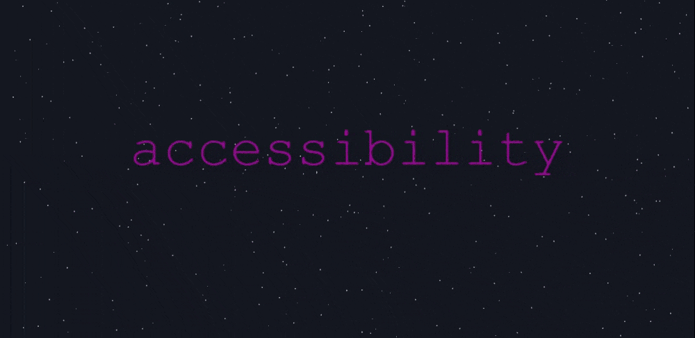

# Deia

## 💡 Inspiration 💡

Deia is a platform for developers that aims to help them build an internet that is diverse, equitable, inclusive, and accessible. We were inspired to create Deia because we recognized that developers have the power to shape the internet and make it more accessible and inclusive for all users. We believe that by providing developers with the resources and support they need to create products that are accessible and inclusive, we can help them build a more diverse and equitable internet. Through Deia, we aim to empower developers to create digital products that are accessible and inclusive to people of all abilities and backgrounds, and to help create a more diverse and equitable tech industry overall.

## ⚙ What it does ⚙

The app is designed to support developers in creating websites, applications, and other digital products that are inclusive and accessible to all users, regardless of their ability or background. One of the key features of Deia is its support for developers in creating inclusive user experiences. The platform provides guidance and resources on how to design and build products that are accessible to people with disabilities, such as those who are blind, deaf, or have mobility impairments. This includes support for designing websites and applications that are keyboard-navigable, have high contrast, and use clear and concise language.
